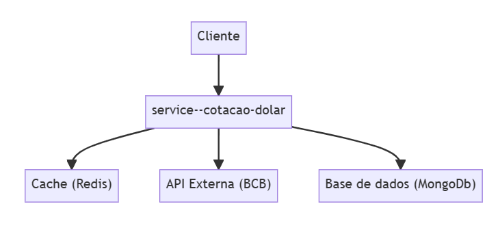

# Arquitetura

## Visão Geral
A arquitetura do projeto é baseada em uma abordagem de microserviços, permitindo escalabilidade, flexibilidade e manutenibilidade.

Faz utilização de cache para aprimorar o desempenho e reduzir a carga no banco de dados.

## Componentes Principais
1. **Serviço de Autenticação:** Responsável pela autenticação das requisições via Chave de API.

2. **Serviço de Cotação do Dólar:** API para proporcionar para obtenção de cotações do dólar comercial em datas específicas.

3. **Cache em Redis:**: Diminui a carga de trabalho da base de dados e aprimora o desempenho das consultas por meio de cache.

4. **Banco de Dados:**: Persiste a cotação, otimizando a consulta aos dados da API externa.

## Diagrama de Arquitetura
A seguir está o diagrama de arquitetura que ilustra a estrutura e as interações dos componentes do projeto.

## Comunicação Segura
Para garantir a segurança na comunicação entre a página web e a API RESTful, é utilizado o protocolo HTTPS. Isso garante a criptografia dos dados transmitidos e a autenticação do servidor por meio de certificados SSL/TLS.

## Persistência de Dados
O serviço de gerenciamento de usuários utiliza o banco de dados MongoDB para persistir as informações dos usuários. O MongoDB é um banco de dados NoSQL que oferece flexibilidade e escalabilidade para lidar com grandes volumes de dados.

## Cache com Redis
Para melhorar o desempenho na recuperação de dados frequentemente acessados, o serviço de processamento de pedidos utiliza o Redis como uma camada de cache. O Redis é um armazenamento em cache de alto desempenho, permitindo acesso rápido aos dados previamente consultados.

## Autenticação via API-KEY
A autenticação nas requisições é realizada por meio do uso de Chave de API que é validada a cada requisição para garantir a autorização adequada.

