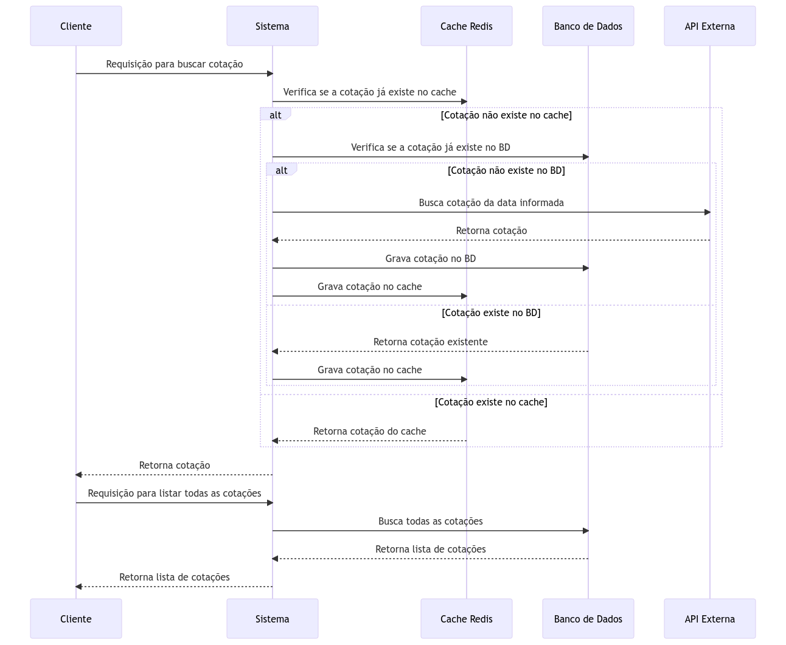

# Especificações
API que consulta a cotação do dólar comercial em uma determinada data fornecida na requisição, utilizando como fonte os dados abertos do Banco Central do Brasil.

## Fluxo da aplicação

#### 1. **Usuário Solicita Cotação do Dólar**
1. **Usuário** faz uma requisição para obter a cotação do dólar para uma data específica.

2. **Sistema** verifica no cache do Redis se a cotação já existe.
3. Se a cotação existir no cache, o sistema a retorna ao usuário.

#### 2. **Cotação Não Existe no Cache**
1. Se a cotação não existir no cache, o **Sistema** verifica no banco de dados.
2. Se a cotação existir no banco de dados, o sistema salva a cotação no cache do Redis e a retorna ao usuário.

#### 3. **Cotação Não Existe no Banco de Dados**
1. Se a cotação não existir no banco de dados, o **Sistema** faz uma requisição para a API externa para obter a cotação.
2. O **Sistema** salva a cotação obtida no banco de dados e no cache do Redis e a retorna ao usuário.

#### 4. **Usuário Solicita Lista de Todas as Cotações**
1. **Usuário** faz uma requisição para listar todas as cotações do banco de dados.
2. **Sistema** busca todas as cotações no banco de dados e retorna ao usuário.
